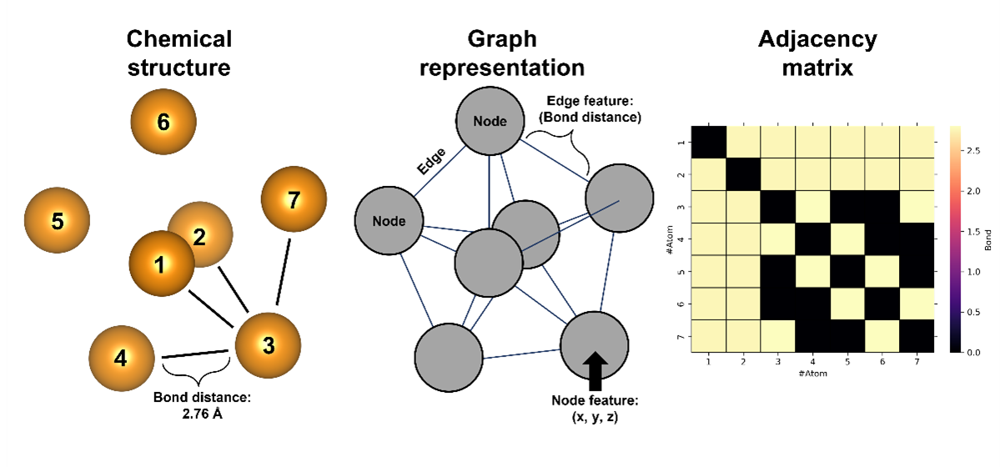
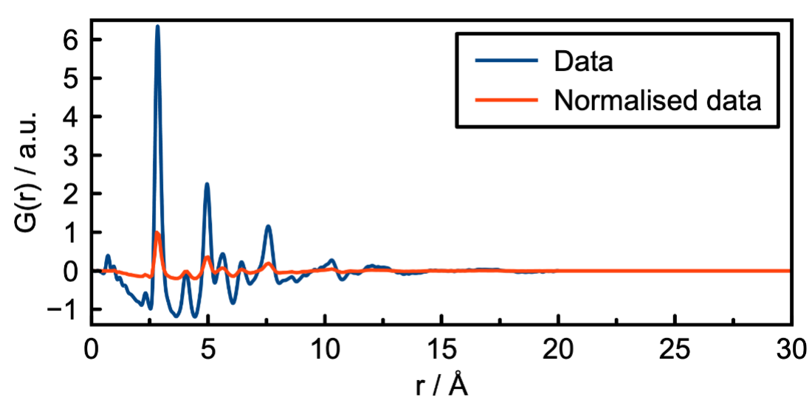

[ChemRxiv](https://chemrxiv.org/engage/chemrxiv/article-details/6221f17357a9d20c9a729ecb)  |  [Paper] XXX

# Data introduction
This folder contains __graphs__-, __utils__ folder and a gen_data.py script.  
The __graphs__ folder contains a small set of graph which can be used to varify that DeepStruc is running. To
generate a broader distribution of mono-metallic nanoparticles (MMNPs) for training, validation and testing the gen_data.py 
script is needed.
  

1. [Generate data](#generate-data)
    1. [Generate data arguments](#generate-data-arguments)
2. [Generel data structure](#generel-data-structure)
    1. [Mono-metallic nanoparticles (MMNPs)](#mono-metallic-nanoparticles-mmnps)
    2. [Graph representation](#graph-representation)
    3. [Pair Distribution Function (PDF)](#pair-distribution-function-pdf)

# Generate data
[DiffPy-CMI](https://www.diffpy.org/products/diffpycmi/index.html) in required to simulate PDFs, which only runs on Linux or macOS. To run it on a Windows computer
please use the [Ubuntu subsystem](https://ubuntu.com/tutorials/ubuntu-on-windows#1-overview). To generate more data run the gen_data.py script. The scripts takes a range of arguments which are all descriped below
or use the __help__ command to produce the parameter list. The __help__ argument will also show default values.  
```
python gen_data.py --help
>>> usage: gen_data.py [-h] [-d DIRECTORY] [-a ATOMS [ATOMS ...]]
>>>                    [-t {SC,FCC,BCC,HCP,Ico,Dec,Oct} [{SC,FCC,BCC,HCP,Ico,Dec,Oct} ...]] 
>>>                    [-n NUM_ATOMS] [-i INTERPOLATION] [-q QMIN] [-Q QMAX]  
>>>                    [-r RMIN] [-R RMAX] [-rs RSTEP] [-b BISO]    
>>>
>>> Generating structures, graphs and conditional PDFs for DeepStruc.    
>>> ...
```

## Generate data arguments
List of possible arguments or run the '--help' argument for additional information.  
 
| Arg | Description | Example |  
| --- | --- |  --- |  
| `-h` or `--help` | Prints help message. |    
| `-d` or `--directory` | Prints help message. __str__ | `-d new_data`  |   
| `-a` or `--atoms` | An atom or list of atoms. __str__| `-a Nb W Mo`  |
| `-t` or `--structure_type` | A single or list of structure types. Possible structure types are: SC, FCC, BCC, HCP, Ico, Dec and Oct. __str__| `-t SC Ico`  |  
| `-n` or `--num_atoms` | Maximum number of possible atoms in structures generated. __int__| `-n 200`  |  
| `-i` or `--interpolation` | Prints help message. __int__| `-i 3`  |  
| `-q` or `--qmin` | Smallest scattering amplitude for simulated PDFs. __float__| `-q 0.2`  |  
| `-Q` or `--qmax` | Largest scattering amplitude for simulated PDFs. __float__| `-Q 22.3`  |  
| `-p` or `--qdamp` | PDF Gaussian dampening factor due to limited Q-resolution. Not applied when equal to zero. __float__| `-p 0.02`  |  
| `-r` or `--rmin` | Smallest r-value for simulated PDFs. __float__| `-r 1.5`  |  
| `-R` or `--rmax` | Largest r-value for simulated PDFs. __float__| `-R 20.0`  |  
| `-s` or `--rstep` | r-grid spacing for simulated PDFs. __float__| `-s 0.1`  |  
| `-e` or `--delta2` | Coefficient for (1/r**2) contribution to the peak sharpening. __float__| `-e 3.5`  |  
| `-b` or `--biso` | Isotropic Atomic Displacement Parameter for simulated PDFs. __float__| `-b 0.2`  |  

  
# Generel data structure
A simplified description is shown below. For detailed description of the data format please revisit the paper.

## Mono-metallic nanoparticles (MMNPs)
To simulate MMNPs we use the [ASE](https://wiki.fysik.dtu.dk/ase/#) library. All of the MMNPs are in a XYZ format where the elements and their euclidian distances are described as seen below:

Atom<sub>1</sub> &nbsp; &nbsp; x<sub>1</sub> &nbsp; &nbsp; y<sub>1</sub> &nbsp; &nbsp; z<sub>1</sub> <br>
Atom<sub>2</sub> &nbsp; &nbsp; x<sub>2</sub> &nbsp; &nbsp; y<sub>2</sub> &nbsp; &nbsp; z<sub>2</sub> <br>
...  
Atom<sub>N</sub> &nbsp; &nbsp; x<sub>N</sub> &nbsp; &nbsp; y<sub>N</sub> &nbsp; &nbsp; z<sub>N</sub> <br>

## Graph representation
Each structure in graph representation can be described as, G = (X,A), where X ∈ R<sup>N×F</sup> is the node feature matrix which contains F features that can describe each of the N atoms in the structure. We use F = 3 comprising only the Euclidean coordinates of the atom in a 3-dimensional space. The interatomic relationships are captured using the adjacency matrix A ∈ R<sup>N×N</sup>. In our case, the entries of the adjacency matrix are the Euclidean distance between pairs of atoms resulting in a soft adjacency matrix. However, when the distance between any pair of nodes is larger than the lattice constant the corresponding edge weight is set to zero. 

The following figure shows a decahedron consisting of seven atoms alongside the components describing it in our chosen graph representation!

 
## Pair Distribution Function (PDF)
The PDF is the Fourier transform of total scattering data, which can be obtained through x-ray, neutron or electron scattering.
G(r) can be interpreted as a histogram of real-space interatomic distances and the information is equivalent to that of an unassigned distance matrix. <br> 
A simulated PDF and how we normalise them are shown below:


